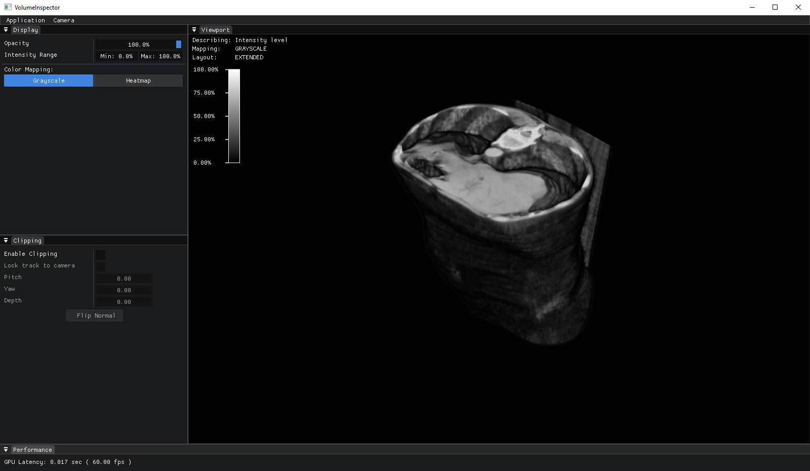
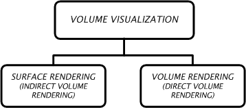
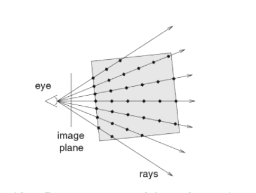
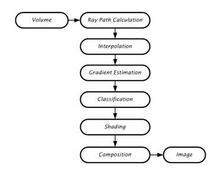

# VolumeInspector

List of contents:
- [Overview](#overview)
- [Volume Rendering](#volume-rendering)
    - [Definition](#definition)
    - [Real life applications](#real-life-applications)
    - [Volumetric Data](#volumetric-data)
    - [Rendering algorithms](#rendering-algorithms)
        - [Indirect volume rendering](#indirect-volume-rendering)
        - [Direct volume rendering](#direct-volume-rendering)
    - [Implementation in VolumeInspector](#implementation-in-volumeinspector)
- [Features](#features)
<!-- - [Requirements](#requirements) -->
- [References](#references)

## Overview
VolumeInspector is an early-stage technical software for volume visualization and basic analysis, orienting towards medical applications. It is build on top of the [Mobius rendering engine]() and utilizes many of its features. This software is a proof of concept and its development process proved to be a solid educational starting point for technical software development with demands on graphics. It is not intended to become a fully-featured application, or a marketable product.

---
## Volume Rendering
Computer display screens are composed of a two-dimensional array of pixels each representing a unit area. A volume is a three-dimensional array of cubic elements, each representing a unit of space. Individual elements of a three-dimensional space are called volume elements or voxels. A number associated with each point in a volume is called the value at that point. The collection of all these values is called a scalar field on the volume. The set of all points in the volume with a given scalar value is called a level surface.

### Definition
Volume rendering is the process of displaying scalar fields [1]. It is a method for visualizing a three dimensional data set. The interior information about a data set is projected to a display screen using the volume rendering methods. Along the ray path from each screen pixel, interior data values are examined and encoded for display. How the data are encoded for display depends on the application. Seismic data, for example, is often examined to find the maximum and minimum values along each ray. The values can then be color coded to give information about the width of the interval and the minimum value. In medical applications, the data values are opacity factors in the range from 0 to 1 for the tissue and bone layers. Bone layers are completely opaque, while tissue is somewhat transparent [2, 3]. Voxels represent various physical characteristics, such as density, temperature, velocity, and pressure. Other measurements, such as area, and volume, can be extracted from the volume datasets [4, 5].

### Real life applications
Real life applications of volume visualization are:
- **Medical Imaging** (e.g., computed tomography, magnetic resonance imaging, ultrasonography)
- **Biology** (e.g., confocal microscopy)
- **Geophysics** (e.g., seismic measurements from oil and gas exploration)
- **Industry** (e.g., finite element models)
- **Molecular Systems** (e.g., electron density maps)
- **Meteorology** (e.g., stormy (prediction)
- **Computational Fluid Dynamics** (e.g., water flow)
- **Computational Chemistry** (e.g., new materials)
- **Digital Signal and Image Processing** (e.g., CSG ) <!-- .[6, 7] -->

Numerical simulations and sampling devices such as magnetic resonance imaging (MRI), computed tomography (CT), positron emission tomography (PET), ultrasonic imaging, confocal microscopy, supercomputer simulations, geometric models, laser scanners, depth images estimated by stereo disparity, satellite imaging, and sonar are sources of large 3D datasets.

### Volumetric Data
Volumetric data is typically a set of samples S(x, y, z, w), representing the value or weight *w* of some property of the data, at a 3D location (x, y, z). If the value is simply a 0 or a 1, with a value of 0 indicating background and a value of 1 indicating the object, then the data is referred to as binary data. The data may instead be multi-valued, with the value representing some measurable property of the data, including, for example, color, density, heat or pressure. In general, the samples may be taken at purely random locations in space, but in most cases the set S is isotropic containing samples taken at regularly spaced intervals along three orthogonal axes. When the spacing between samples along each axis is a constant, then S is called isotropic, but there may be three different spacing constants for the three axes. In that case the set S is anisotropic. Since the set of samples is defined on a regular grid, a 3D array (called also volume buffer, cubic frame buffer, 3D raster) is typically used to store the values, with the element location indicating position of the sample on the grid. For this reason, the set S will be referred to as the array of values S(x, y, z), which is defined only at grid locations. Alternatively, either rectilinear, curvilinear (structured) [11], or unstructured grids, are employed (Figure 1.1) [12].
  
<figure id="vva-class">
  
  <figcaption style="font-style: italic">
    <strong>Figure 1.1 </strong>
    <em>
        Grid types in volumetric data.
        <strong>a. </strong>
        Cartesian grid,
    </em>
    <em>
        <strong>b. </strong>
        Regular grid,
    </em>
    <em>
        <strong>c. </strong>
        Rectilinear grid,
    </em>
    <em>
        <strong>d. </strong>
        Curvilinear grid,
    </em>
    <em>
        <strong>e. </strong>
        Block structured grid,
    </em>
    <em>
        <strong>f. </strong>
        Unstructured grid
    </em>
  </figcaption>
</figure>
  

Volumes of data are usually treated as either an array of voxels or an array of cells. These two approaches stem from the need to resample the volume between grid points during the rendering process. Resampling, requiring interpolation, occurs in almost every volume visualization algorithm. Since the underlying function is not usually known, and it is not known whether the function was sampled above the Nyquist frequency, it is impossible to check the reliability of the interpolation used to find data values between discrete grid points. It must be assumed that common interpolation techniques are valid for an image to be considered valid.

### Rendering algorithms
Volume visualization has been the most active sub-area of researches during last 25 years in scientific visualization. To be useful, volume visualization techniques must offer understandable data representations, quick data manipulation, and reasonably fast rendering. Scientific users should be able to change parameters and see the resultant image instantly. Few present day systems are capable of this type of performance; therefore researchers are still studying many new ways to use volume visualization effectively.

The rendering approaches differ in several aspects which can be used for their detailed classification in various ways [8, 9, 14-18]. Coarsely, volume visualization is done using two different approaches based on the portion of the volume raster set which they render: (Figure 1.4)

- **Surface rendering** (or indirect volume rendering)
- **Volume rendering** (or direct volume rendering)

<figure id="vva-class">
  
  <figcaption style="font-style: italic">
    <strong>Figure 1.4 </strong>
    <em>Classification of volume visualization algorithms</em>
  </figcaption>
</figure>
  

#### Indirect volume rendering
Indirect rendering, or surface oriented algorithms are standard for nearly all 3D visualization problems. Surface oriented algorithms first fit geometric primitives to values in the data, and then render these primitives. The data values are usually chosen from an iso-surface, which is the set of locations in the data where the scalar field equals some value. In typical datasets from medical or scientific applications, the iso-surface forms a connected surface, such as the air/skin or brain/bone boundary in a CT dataset. With dedicated vector hardware, these models can be calculated very efficiently. Examples of surface oriented hardware are Reality Engine, HP, SUN, IBM, and PIXAR. Typical visualization problems to be solved in the medical context are e.g. tissues that have no defined surface or blood vessels whose size is close to the limit of imaging resolution. However surface oriented methods leave these problems unsolved.

An indirect volume rendering system transforms the data into a different domain (e.g., compression, boundary representation, etc.). Typically, the data is transformed into a set of polygons representing a level surface (or iso-surface); then conventional polygon rendering methods are used to project the polygons into an image [9]. Many methods exist for indirect volume rendering (surface rendering), which are defined as visualizing a volumetric dataset by first transferring the data into a different domain and rendering directly from the new domain. Indirect volume rendering can be classified as surface tracking, iso-surfacing, and domain-based rendering. Indirect methods are often chosen because of a particular form of hardware acceleration or because of a speed advantage [4, 10, 13, 14, 16-19].
  

#### Direct volume rendering
Direct volume rendering, or volume rendering (oriented) algorithms render every voxel in the volume raster directly, without conversion to geometric primitives or first converting to a different domain and then rendering from that domain. The data is considered to represent a semi-transparent light-emitting medium. Therefore also gaseous phenomena can be simulated.

Approaches in a direct volume rendering system, are based on the laws of physics (emission, absorption, scattering). The volume data is used as a whole, which means that all interior structures are visible through the volume. One of the most commonly used approach is ray casting.

##### Ray Casting
Typically, a viewing ray is traversed from the eye point through each pixel into the volume. While a ray is being traversed, the volume rendering integral is evaluated for that ray. The natural compositing order is front-to-back i.e., from the eye into the volume. **Figure 1.5** illustrates the principle of ray casting. Ray casting can be regarded as the volume rendering analogue of traditional ray tracing for surface-based geometry according to Whitted [20]. One important difference is that ray casting does not spawn secondary rays, like ray tracing does. Ray casting is often used for data given on uniform Cartesian grids. It is common practice to employ an equidistant sampling along the viewing rays, as shown in **Figure 1.5**. Equidistant sampling leads to the [Rienmann sum approximation](https://en.wikipedia.org/wiki/Riemann_sum) of the volume rendering integral. An interpolation filter is applied during sampling because the sampling positions differ from grid locations. Popular filters are **nearest neighbour (box)**, **trilinear interpolation** or more sophisticated **(Gaussian, cubic spline)**. Trilinear is the most popular reconstruction filter for uniform grids.

<figure id="vva-class">
  
  <figcaption style="font-style: italic">
    <strong>Figure 1.5 </strong>
    <em>Ray casting idea. Rays are traversed from the eye into the volume. The volume is sampled at positions along the rays (indicated by dots) to compute the volume rendering integral.</em>
  </figcaption>
</figure>
  

In its basic form, the volume ray casting algorithm can be described by the following diagram, **Figure 1.6** demonstrates:

<figure id="vva-class">
  
  <figcaption style="font-style: italic">
    <strong>Figure 1.6 </strong>
    <em>The data flow diagram of a ray casting system.</em>
  </figcaption>
</figure>
  

Initially, the ray-path calculation determines the voxels that are penetrated by a given ray. The interpolation estimates the value at a re-sample location using a small neighborhood of voxel values. The gradient estimation estimates a surface normal using a neighborhood of voxels surrounding the re-sample location. The classification maps interpolated sample values and the estimated surface normal to a color and opacity. The shading uses the gradient and classification information to compute a color that takes the interaction of light into account on the estimated surfaces in the dataset. The composition uses shaded color values and the opacity to compute a final pixel color to display. Ray casting can be classified into two sub-classes according to the level of interpolation used [13]:

<!-- Should those be kept?? -->
- Algorithms that use a zero order interpolation
- Algorithms that use a higher order interpolation

Algorithms that use a zero order interpolation are Binary Ray Casting, and Discrete Ray Casting. Binary Ray Casting was developed to generate images of surfaces contained within binary volumetric data without the need to explicitly perform boundary detection and hidden-surface removal. For each pixel on the image plane, a ray is cast from that pixel to determine if it intersects the surface contained within the data. In order to determine the first intersection along the ray a stepping technique is used where the value is determined at regular intervals along the ray until the object is intersected. Data samples with a value of 0 are considered to be the background while those with a value of 1 are considered to be a part of the object [65]. In Discrete Ray Casting, instead of traversing a continuous ray and determining the closest data sample for each step, a discrete representation of the ray is traversed [14]. This discrete ray is generated using a 3D Bresenham-like algorithm or a 3D line scan-conversion (voxelization) algorithm [66, 67]. As in the previous algorithms, for each pixel in the image plane, the data samples which contribute to it need to be determined. This could be done by casting a ray from each pixel in the direction of the viewing ray. This ray would be discretized (voxelized), and the contribution from each voxel along the path is considered when producing the final pixel value [68].

Algorithms that use a higher order interpolation are the image order volume rendering algorithm of Levoy, V-Buffer image order ray casting , and V-Buffer cell-by-cell processing. The image-order volume rendering algorithm developed by Levoy [69] states that given an array of data samples , two new arrays which define the color and opacity at each grid location can be generated using preprocessing techniques. The interpolation functions which specify the sample value, color, and opacity at any location in volume, are then defined by using transfer functions proposed by him. Generating the array of color values involves performing a shading operation. In V-Buffer image order ray casting method, rays are cast from each pixel on the image plane into the volume. For each cell in the volume along the path of this ray, a scalar value is determined at the point where the ray first intersects the cell. The ray is then stepped along until it traverses the entire cell, with calculations for scalar values, shading, opacity, texture mapping, and depth cuing performed at each stepping point. This process is repeated for each cell along the ray, accumulating color and opacity, until the ray exits the volume, or the accumulated opacity reaches to unity. At this point, the accumulated color and opacity for that pixel are stored, and the next ray is cast. The goal of this method is not to produce a realistic image, but instead to provide a representation of the volumetric data which can be interpreted by a scientist or an engineer. In V-Buffer cell-by-cell processing method each cell in the volume is processed in a front-to-back order [14, 70]. Processing begins on the plane closest to the viewpoint, and progresses in a plane-by-plane manner. Within each plane, processing begins with the cell closest to the viewpoint, and then continues in the order of increasing distance from the viewpoint. Each cell is processed by first determining for each scan line in the image plane which pixels are affected by the cell. Then, for each pixel an integration volume is determined. This process continues in a front-to-back order, until all cells have been processed, with an intensity accumulated into pixel values.

<!-- Should those be kept?? -->

---

### Implementation in VolumeInspector

Lorem ipsum dolor sit amet, consectetur adipisicing elit, sed do eiusmod tempor incididunt ut labore et dolore magna aliqua. Ut enim ad minim veniam, quis nostrud exercitation ullamco laboris nisi ut aliquip ex ea commodo consequat. Duis aute irure dolor in reprehenderit in voluptate velit esse cillum dolore eu fugiat nulla pariatur. Excepteur sint occaecat cupidatat non proident, sunt in culpa qui officia deserunt mollit anim id est laborum.

---
## Features

#### Dockable Panels
Lorem ipsum dolor sit amet, consectetur adipisicing elit, sed do eiusmod tempor incididunt ut labore et dolore magna aliqua. Ut enim ad minim veniam,

#### Opacity Control
Lorem ipsum dolor sit amet, consectetur adipisicing elit, sed do eiusmod tempor incididunt ut labore et dolore magna aliqua. Ut enim ad minim veniam,

#### Intensity Value Clamping
Lorem ipsum dolor sit amet, consectetur adipisicing elit, sed do eiusmod tempor incididunt ut labore et dolore magna aliqua. Ut enim ad minim veniam,

#### Color Mapping
Lorem ipsum dolor sit amet, consectetur adipisicing elit, sed do eiusmod tempor incididunt ut labore et dolore magna aliqua. Ut enim ad minim veniam,

#### Volume Clipping Plane
Lorem ipsum dolor sit amet, consectetur adipisicing elit, sed do eiusmod tempor incididunt ut labore et dolore magna aliqua. Ut enim ad minim veniam,

---

### Controls

The user is expected to use the software, operating with keyboard and mouse(wheeled). Current control bindings based on active context, are:

When active context is *Viewport*:
- `MiddleMouseButton` - Camera orientation (fixed pivot from origin).
- `RightMouseButton` - Context menu popup. Option for legend visibility.
- `Ctrl + WheelUp/WheelDown` - Clipping plane depth increase/decrease.
- `Ctrl + Num0` - Camera orientation reset.

When active context is *Clipping*:
- `LeftMouseButton` - Selection (single) | Manual value input (double).
- `RightMouseButton` - Value reset.

When active context is *Display*:
- `LeftMouseButton` - Selection (single) | Manual value input (double).

---

## References
1. Foley, J.D., Dam, A.V., Feiner S.K., and Hughes J.F. (1990). *Computer Graphics: Principles and Practice.* (2th ed.). Massachusetts: Addison-Wesley Publishing Company.

2. Hearn, D., and Baker, M.P. (1997). *Computer Graphics C Version.* (2th ed.). New Jersey: Prentice Hall.

3. Foley, J.D., Dam, A.V., Feiner S.K., and Hughes J.F., Phillips R.L. (1995). *Introduction to Computer Graphics.* Massachusetts: Addison-Wesley.

4. Ray, H., Pfister, H., Silver, D., and Cook, T.A. (1999). Ray Casting Architectures for Volume Visualization. *IEEE Transactions on Visualization and Computer Graphics, 5*(3), 210-233

5. Jones, M.W. (1996). The Production of Volume Data fram Triangular Meshes Using Voxelization. *Computer Graphics Forum, 15*(5), 311-318

6. Cooke, J.M., Zyda, M.J., Pratt, D.R., and McGhee, R.B. (1992). NPSNET: Flight Simulation Dynamic Modeling Using Quaternions. *Teleoperations and Virtual Environments, 1*(4), 404-420

7.  Schalkoff, R.J. (1989). *Digital Image Processing and Computer Vision.* Singapore: John Wiley & Sons Publishing.

8. Jürgen, H., Manner, R., Knittel, G., and Strasser, W. (1995). Three Architectures for Volume Rendering. *International Journal of the Eurographics Association, 14*, 111-122

9. Dachille, F. (1997). Volume Visualization Algorithms and Architectures. *Research Proficiency Exam, SUNY at Stony Brook*

10. Yagel, R. (1996). Towards Real Time Volume Rendering. *Proceedings of GRAPHICON' 96*, 230-241

11. Ma, K.L., and Crockett, T.W. (1997). A Scalable Parallel Cell-Projection Volume Rendering Algorithm for Three-Dimensional Unstructured Data. *IEEE Parallel Rendering Symposium*, 95-104

12. Kaufman, A.E. (1997). Volume Visualization: Principles and Advances. *SIGGRAPH '97*, 23-35

13. Kaufman, A.E. (1994). Voxels as a Computational Representation of Geometry. in *The Computational Representation of Geometry SIGGRAPH '94* Course Notes

14. Günther, T., Poliwoda, C., Reinhart, C., Hesser, J., and Manner, J. (1994). VIRIM: A Massively Parallel Processor for Real-Time Volume Visualization in Medicine. *Proceedings of the 9th Eurographics Hardware Workshop*, 103-108

15. Boer, M.De, Gröpl, A., Hesser, J., and Manner, R. (1996). Latency-and Hazard-free Volume Memory Architecture for Direct Volume Rendering. *Eurographics Workshop on Graphics Hardware*, 109-119

16. Swan, J.E. (1997). Object Order Rendering of Discrete Objects. PhD. Thesis, Department of Computer and Information Science, The Ohio State University

17. Yagel, R. (1996). Classification and Survey of Algorithms for Volume Viewing. SIGGRAPH tutorial notes (course no. 34)

18. Law,A. (1996). Exploiting Coherency in Parallel Algorithms for Volume Rendering. *PhD. Thesis, Department of Computer and Information Science*, The Ohio State University

19. Lacroute, P., and Levoy, M. (1994). Fast Volume Rendering Using a Shear-Warp Factorization of the Viewing Transform. *Computer Graphics Proceedings Annual Conference Series ACM SIGGRAPH*, 451-458.

20. Whitted T. (1979) *An Improved Illumination Model for Shaded Display*. Proceedings of the 6th annual conference on Computer graphics and interactive techniques
