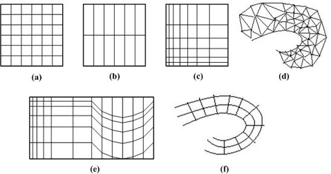

# VolumeInspector

List of contents:
- [Overview](#overview)
- [Volume Rendering](#volume-rendering)
    - [Definition](#definition)
    - [Real life applications](#real-life-applications)
    - [Volumetric Data](#volumetric-data)
    - [Rendering algorithms](#rendering-algorithms)
        - [Indirect volume rendering](#indirect-volume-rendering)
        - [Direct volume rendering](#direct-volume-rendering)
    - [Implementation in VolumeInspector](#)
- [Features](#)
- [References](#)

## Overview
VolumeInspector is an early-stage technical software for volume visualization and basic analysis, orienting towards medical applications. It is build on top of the [Mobius rendering engine]() and utilizes many of its features. This software is a proof of concept and its development process proved to be a solid educational starting point for technical software development with demands on graphics. It is not intended to become a fully-featured application, or a marketable product.

---
## Volume Rendering
Computer display screens are composed of a two-dimensional array of pixels each representing a unit area. A volume is a three-dimensional array of cubic elements, each representing a unit of space. Individual elements of a three-dimensional space are called volume elements or voxels. A number associated with each point in a volume is called the value at that point. The collection of all these values is called a scalar field on the volume. The set of all points in the volume with a given scalar value is called a level surface.

### Definition
Volume rendering is the process of displaying scalar fields [1]. It is a method for visualizing a three dimensional data set. The interior information about a data set is projected to a display screen using the volume rendering methods. Along the ray path from each screen pixel, interior data values are examined and encoded for display. How the data are encoded for display depends on the application. Seismic data, for example, is often examined to find the maximum and minimum values along each ray. The values can then be color coded to give information about the width of the interval and the minimum value. In medical applications, the data values are opacity factors in the range from 0 to 1 for the tissue and bone layers. Bone layers are completely opaque, while tissue is somewhat transparent [2, 3]. Voxels represent various physical characteristics, such as density, temperature, velocity, and pressure. Other measurements, such as area, and volume, can be extracted from the volume datasets [4, 5].

### Real life applications
Real life applications of volume visualization are:
- **Medical Imaging** (e.g., computed tomography, magnetic resonance imaging, ultrasonography)
- **Biology** (e.g., confocal microscopy)
- **Geophysics** (e.g., seismic measurements from oil and gas exploration)
- **Industry** (e.g., finite element models)
- **Molecular Systems** (e.g., electron density maps)
- **Meteorology** (e.g., stormy (prediction)
- **Computational Fluid Dynamics** (e.g., water flow)
- **Computational Chemistry** (e.g., new materials)
- **Digital Signal and Image Processing** (e.g., CSG ) <!-- .[6, 7] -->

Numerical simulations and sampling devices such as magnetic resonance imaging (MRI), computed tomography (CT), positron emission tomography (PET), ultrasonic imaging, confocal microscopy, supercomputer simulations, geometric models, laser scanners, depth images estimated by stereo disparity, satellite imaging, and sonar are sources of large 3D datasets.

### Volumetric Data
Volumetric data is typically a set of samples S(x, y, z, w), representing the value or weight *w* of some property of the data, at a 3D location (x, y, z). If the value is simply a 0 or a 1, with a value of 0 indicating background and a value of 1 indicating the object, then the data is referred to as binary data. The data may instead be multi-valued, with the value representing some measurable property of the data, including, for example, color, density, heat or pressure. In general, the samples may be taken at purely random locations in space, but in most cases the set S is isotropic containing samples taken at regularly spaced intervals along three orthogonal axes. When the spacing between samples along each axis is a constant, then S is called isotropic, but there may be three different spacing constants for the three axes. In that case the set S is anisotropic. Since the set of samples is defined on a regular grid, a 3D array (called also volume buffer, cubic frame buffer, 3D raster) is typically used to store the values, with the element location indicating position of the sample on the grid. For this reason, the set S will be referred to as the array of values S(x, y, z), which is defined only at grid locations. Alternatively, either rectilinear, curvilinear (structured) [12], or unstructured grids, are employed (Figure 1.1) [13].
  
<figure id="vva-class">
  
  <figcaption style="font-style: italic">
    <strong>Figure 1.1 </strong>
    <em>
        Grid types in volumetric data.
        <strong>a. </strong>
        Cartesian grid,
    </em>
    <em>
        <strong>b. </strong>
        Regular grid,
    </em>
    <em>
        <strong>c. </strong>
        Rectilinear grid,
    </em>
    <em>
        <strong>d. </strong>
        Curvilinear grid,
    </em>
    <em>
        <strong>e. </strong>
        Block structured grid,
    </em>
    <em>
        <strong>f. </strong>
        Unstructured grid
    </em>
  </figcaption>
</figure>
  

Volumes of data are usually treated as either an array of voxels or an array of cells. These two approaches stem from the need to resample the volume between grid points during the rendering process. Resampling, requiring interpolation, occurs in almost every volume visualization algorithm. Since the underlying function is not usually known, and it is not known whether the function was sampled above the Nyquist frequency, it is impossible to check the reliability of the interpolation used to find data values between discrete grid points. It must be assumed that common interpolation techniques are valid for an image to be considered valid.

### Rendering algorithms
Volume visualization has been the most active sub-area of researches during last 20 years in scientific visualization. To be useful, volume visualization techniques must offer understandable data representations, quick data manipulation, and reasonably fast rendering. Scientific users should be able to change parameters and see the resultant image instantly. Few present day systems are capable of this type of performance; therefore researchers are still studying many new ways to use volume visualization effectively.

The rendering approaches differ in several aspects which can be used for their detailed classification in various ways [8, 9, 17-21]. Coarsely, volume visualization is done using two different approaches based on the portion of the volume raster set which they render: (Figure 1.4)

- **Surface rendering** (or indirect volume rendering)
- **Volume rendering** (or direct volume rendering)

<figure id="vva-class">
  
  <figcaption style="font-style: italic">
    <strong>Figure 1.4 </strong>
    <em>Classification of volume visualization algorithms</em>
  </figcaption>
</figure>
  

#### Indirect volume rendering
Indirect rendering, or surface oriented algorithms are standard for nearly all 3D visualization problems. Surface oriented algorithms first fit geometric primitives to values in the data, and then render these primitives. The data values are usually chosen from an iso-surface, which is the set of locations in the data where the scalar field equals some value. In typical datasets from medical or scientific applications, the iso-surface forms a connected surface, such as the air/skin or brain/bone boundary in a CT dataset. With dedicated vector hardware, these models can be calculated very efficiently. Examples of surface oriented hardware are Reality Engine, HP, SUN, IBM, and PIXAR. Typical visualization problems to be solved in the medical context are e.g. tissues that have no defined surface or blood vessels whose size is close to the limit of imaging resolution. However surface oriented methods leave these problems unsolved.

An indirect volume rendering system transforms the data into a different domain (e.g., compression, boundary representation, etc.). Typically, the data is transformed into a set of polygons representing a level surface (or iso-surface); then conventional polygon rendering methods are used to project the polygons into an image [9]. Many methods exist for indirect volume rendering (surface rendering), which are defined as visualizing a volumetric dataset by first transferring the data into a different domain and rendering directly from the new domain. Indirect volume rendering can be classified as surface tracking, iso-surfacing, and domain-based rendering. Indirect methods are often chosen because of a particular form of hardware acceleration or because of a speed advantage [4, 10, 14, 17, 19-22].
  

#### Direct volume rendering
Direct volume rendering, or volume rendering (oriented) algorithms render every voxel in the volume raster directly, without conversion to geometric primitives or first converting to a different domain and then rendering from that domain. The data is considered to represent a semi-transparent light-emitting medium. Therefore also gaseous phenomena can be simulated.

The approaches in a direct volume rendering system, are based on the laws of physics (emission, absorption, scattering). The volume data is used as a whole, which means that all interior structures are visible through the volume.

---

### Implementation in VolumeInspector

Lorem ipsum dolor sit amet, consectetur adipisicing elit, sed do eiusmod tempor incididunt ut labore et dolore magna aliqua. Ut enim ad minim veniam, quis nostrud exercitation ullamco laboris nisi ut aliquip ex ea commodo consequat. Duis aute irure dolor in reprehenderit in voluptate velit esse cillum dolore eu fugiat nulla pariatur. Excepteur sint occaecat cupidatat non proident, sunt in culpa qui officia deserunt mollit anim id est laborum.

---
## Features

#### Opacity Manipulation
Lorem ipsum dolor sit amet, consectetur adipisicing elit, sed do eiusmod tempor incididunt ut labore et dolore magna aliqua. Ut enim ad minim veniam,

#### Density Value Clamping
Lorem ipsum dolor sit amet, consectetur adipisicing elit, sed do eiusmod tempor incididunt ut labore et dolore magna aliqua. Ut enim ad minim veniam,

#### Color Mapping
Lorem ipsum dolor sit amet, consectetur adipisicing elit, sed do eiusmod tempor incididunt ut labore et dolore magna aliqua. Ut enim ad minim veniam,

---

### Controls

The user is expected to use the software, operating with keyboard and mouse(wheeled). Current control bindings based on context, are:

When active context is *Viewport*:
- `MiddleMouseButton` - Camera orientation (fixed pivot from origin).
- `RightMouseButton` - Context menu popup. Option for legend visibility.
- `Ctrl + WheelUp/WheelDown` - Cut plane depth increase/decrease.
- `Ctrl + Num0` - Camera orientation reset.

When active context is *Clipping*:
- `LeftMouseButton` - Selection (single) | Manual value input (double).
- `RightMouseButton` - Value reset.

When active context is *Display*:
- `LeftMouseButton` - Selection (single) | Manual value input (double).
